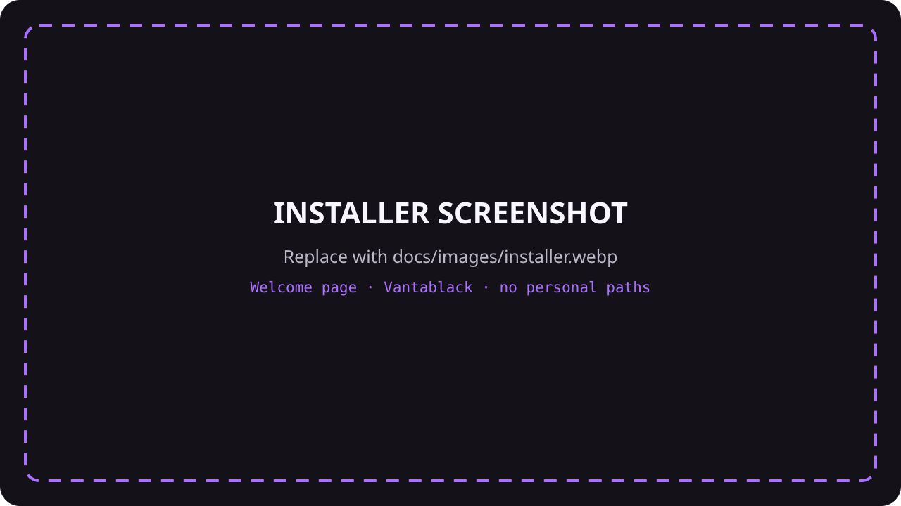
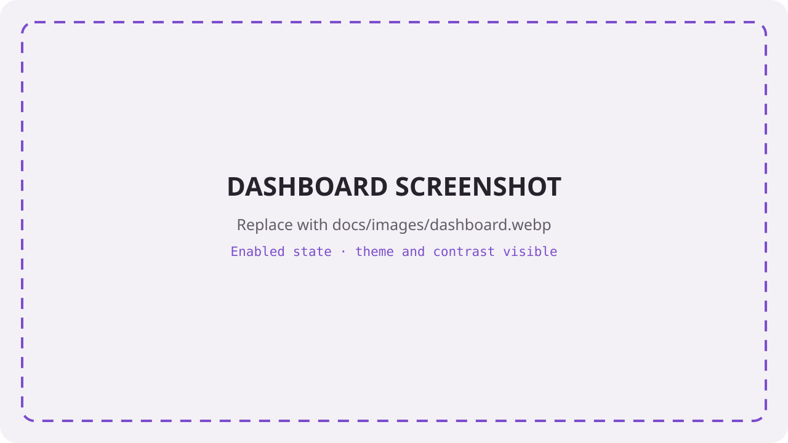
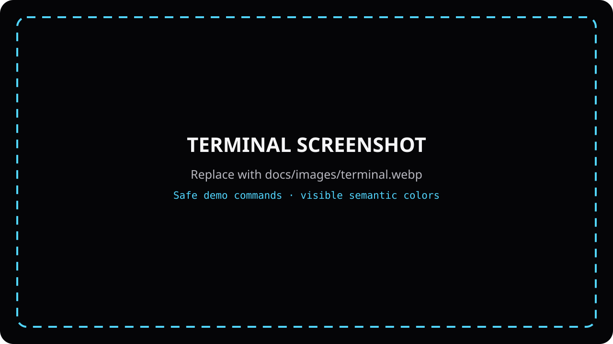

# Command Chroma

Theme-aware semantic Bash command highlighting for **Omarchy**, with a guided
first-run setup, readable contrast, diagnostics, and a native Quattro control panel.

Formerly **Omarchy Chroma**. The existing `chroma` command, configuration, and
installation paths are kept for compatibility. The GitHub repository has not
been renamed.

> Plugin 0.4.0 is currently developed on `codex/command-chroma-plugin`.
> It is not a Marketplace listing or a stable release. To try this branch,
> follow [plugin testing and installation](docs/PLUGIN_TESTING.md).

## Quick start for the development branch

Because the plugin is not on `main` yet, Omarchy's normal add command cannot
select this development branch. For testing, download and extract the
[development ZIP](https://github.com/itsVoid-TV/Omarchy-Chroma/archive/refs/heads/codex/command-chroma-plugin.zip),
open a terminal inside its folder, and run:

```bash
./setup
```

If the archive tool removed executable permissions, use `python3 setup`.
The colorful bootstrap validates the plugin and creates a real Git checkout,
so later updates work through Omarchy. It does not touch `.bashrc`.

Once this branch has passed the real-device checklist and is merged, the normal
installation will be one standard Omarchy command:

```bash
omarchy plugin add https://github.com/itsVoid-TV/Omarchy-Chroma.git --enable
```

Omarchy deliberately does not execute install hooks. The command adds and
enables the widget; clicking its Chroma logo opens the guided installer. The
installer shows every planned change before its final confirmation.

## Preview







These are deliberate placeholders, not generated product screenshots. See
[the image checklist](docs/images/README.md) for exactly what to capture and
where to put it.

## Omarchy plugin

The Chroma logo opens a theme-aware first-run installer or, after setup, the
control panel with:

- installation/enabled status **for new Bash terminals**, plus update detection;
- the active Omarchy theme, background, calculated minimum contrast and target;
- **Set up / update**, **Enable / Disable**, **Reload theme**, **Doctor**, and **Legend**;
- an explicit confirmation before installation, enable/disable, or removal;
- `.bashrc` backups and a removal action that preserves config and `ble.sh`.

Adding/enabling the widget does not install the Bash add-on, download
dependencies, or change `.bashrc`. The guided installer first shows its command
preview, destination, `.bashrc` loader, backup policy and optional pinned ble.sh
download. Only its final **Install Command Chroma** button performs setup. It
installs code from the checked-out plugin revision, not a second clone of
mutable `main`. After a plugin update, open **Set up / update** if the dashboard
reports a Bash update.

The plugin ID is `io.github.itsvoid-tv.command-chroma`. The supported host is
Omarchy **Quattro / 4.x** with `qs.Ui.BarWidget`, `Panel`, and `KeyboardPanel`.
The widget needs Python 3 (standard library only), Bash, and Omarchy's QML host.
The Bash installer uses standard coreutils, awk, curl and tar/xz; the isolated
Doctor uses util-linux's `script`. Bash-only highlighting still works without
the widget or Python.

Enable/disable takes effect in **new** terminals. Existing terminals keep their
loaded integration. **Reload theme** requests a refresh at the next prompt in
already loaded Chroma 0.4+ shells; it does not inject keystrokes, restart terminals,
or reload executable configuration. Open a new terminal after code/config changes.
Doctor opens an isolated diagnostic Bash/ble.sh process; it does not inspect or
change other open terminals.

Palette inspection evaluates your trusted `config.bash`, as the add-on itself
does, but never your `.bashrc`. Passive background status checks do not execute
configuration. The contrast number covers theme-managed foregrounds only;
explicit custom styles are excluded and the legend labels them accordingly.
There is no network activity in the bridge except an explicitly requested setup
download of a missing `ble.sh` dependency.

For removal, use **Remove Bash integration…** first, then:

```bash
omarchy plugin remove io.github.itsvoid-tv.command-chroma
```

Removing/disabling the Omarchy widget alone does not undo a separately installed
Bash add-on. This is intentional: Omarchy does not run plugin uninstall hooks.
Backups are retained in `${XDG_STATE_HOME:-~/.local/state}/omarchy-chroma/backups`.
The [testing guide](docs/PLUGIN_TESTING.md) includes the required on-device checks.

## Bash highlighting

Chroma colors what a command *does* while you type it. Package installation is yellow, removal is red, privileged wrappers are orange, Git is purple, network commands are cyan, and destructive commands are bright red and underlined.

Chroma follows Omarchy's active `colors.toml`. It keeps each theme's own hues,
but raises faint colors until they reach at least **5.5:1 contrast** against the
terminal background. A black theme therefore gets light foreground colors; a
light theme gets dark ones. Theme changes are picked up at the next prompt.

It works in Foot, Ghostty, Alacritty, Kitty, and other compatible terminals
because the feature lives in Bash rather than in one terminal emulator.
`ble.sh` emits exact 24-bit color where supported and falls back to indexed
terminal color otherwise.

## Standalone Bash installation

For Bash highlighting without the Omarchy widget, download and extract the
[standalone `main` ZIP](https://github.com/itsVoid-TV/Omarchy-Chroma/archive/refs/heads/main.zip),
open a terminal inside that folder, and run:

```bash
bash install.sh
```

Then open a new terminal and check the installation:

```bash
chroma doctor
chroma legend
```

To inspect Chroma's decision without executing anything:

```bash
chroma explain 'git push --force-with-lease origin main'
```

Automatic ghost-text suggestions are disabled. Normal Tab completion and
Omarchy's completion/history shortcuts remain available. Chroma also removes
ble.sh's red parse/argument backgrounds and its `[ble: exit N]` marker by
default; semantic danger colors such as red underlined `rm` remain active.

The installer uses only user-owned XDG directories, adds one marked block to
`~/.bashrc`, and does **not** call `sudo`. Updates are assembled in a staging
directory and activated atomically, so an incomplete source cannot overwrite a
working installation. Existing configuration and symlinked `.bashrc` files are
preserved. If `ble.sh` is missing, Chroma downloads one pinned build and
verifies its SHA-256 checksum before installing it locally.

If you prefer an updateable Git checkout:

```bash
git clone https://github.com/itsVoid-TV/Omarchy-Chroma.git
cd Omarchy-Chroma
bash install.sh
```

## Colors

| Meaning | Omarchy theme role | Examples |
|---|---|---|
| Install / update | Yellow, bold | `pacman -Syu`, `flatpak install`, `npm install` |
| Remove | Coral red, bold | `pacman -Rns`, `flatpak uninstall`, `docker rm` |
| Dangerous | Bright red, bold, underlined | `rm`, `dd`, `mkfs`, `git reset --hard`, forced Git pushes |
| Privileged | Orange, bold | `sudo`, `doas`, `pkexec` |
| System | Amber | `systemctl`, `mount`, `chmod` |
| Git / VCS | Purple, bold | `git`, `gh`, `lazygit` |
| Network | Cyan | `curl`, `wget`, `ssh`, `rsync` |
| Containers | Blue | `docker`, `podman`, `kubectl` |
| Build / runtime | Green | `make`, `cargo`, `go`, `node` |
| Navigation / inspection / search / editors | Blue-green variants | `cd`, `bat`, `rg`, `nvim` |

Chroma understands wrappers, their option arguments, and shell chains. This
includes `sudo`, `env`, `command`, `exec`, `time`, `timeout`, `nice`,
`stdbuf`, `ionice`, `taskset`, and `chrt`. For example, in:

```bash
sudo env LANG=C pacman -Syu firefox && git status
```

`sudo` is orange, `pacman -Syu` is yellow, and `git status` is purple.
Arguments such as `firefox` keep normal `ble.sh` syntax highlighting. Query
forms such as `command -v rm` are shown as inspection rather than falsely
warning that `rm` will run.

## Commands

| Command | Purpose |
|---|---|
| `chroma legend` | Show every semantic color with examples |
| `chroma doctor` | Check ble.sh, rendering, theme, config, contrast, and the `.bashrc` loader |
| `chroma explain COMMAND...` | Print token categories and source ranges without executing the command |
| `chroma reload` | Reload the current Omarchy palette and report a useful error if it fails |
| `chroma version` | Print the loaded Chroma version |

Quote the complete line passed to `chroma explain` when spacing or quoting
matters.

## Customize

Edit:

```text
~/.config/omarchy-chroma/config.bash
```

Examples:

```bash
CHROMA_STYLES[install]='fg=yellow,bold'
CHROMA_STYLES[danger]='fg=white,bg=red,bold'

# Opt in only if you want ble.sh's automatic ghost-text suggestions:
CHROMA_SUGGESTIONS=1

# Opt in only if you want ble.sh's red error overlays and exit marker:
CHROMA_BLE_ERROR_FEEDBACK=1

CHROMA_EXTRA_INSTALL_COMMANDS+=(my-installer)
CHROMA_EXTRA_REMOVE_COMMANDS+=(my-uninstaller)
CHROMA_EXTRA_DANGER_COMMANDS+=(my-disk-wiper)
```

Explicit `CHROMA_STYLES[...]` values always win and are not changed by the
contrast guard. To tune the automatic theme integration instead:

```bash
# Enabled by default:
CHROMA_THEME_INTEGRATION=1

# Default: 5.5 (WCAG's normal-text baseline is 4.5):
CHROMA_MIN_CONTRAST=5.5
```

Open a new terminal after changing the configuration. Invalid toggle, array,
or contrast settings fall back safely and are listed by `chroma doctor`.

## Update

For the plugin, use the [plugin update instructions](docs/PLUGIN_TESTING.md#update-the-development-checkout),
then choose **Set up / update** in the dashboard when it reports a Bash update.

For the standalone version, download and extract a current `main` ZIP and run
this from its folder. Your config file is preserved and the code is replaced as
one complete unit:

```bash
bash install.sh
```

For a cloned checkout, use `git pull --ff-only` and run `bash install.sh` again.

## Uninstall

```bash
~/.local/share/omarchy-chroma/uninstall.sh
```

Add `--purge` to remove the user color configuration too. The uninstaller deliberately keeps `ble.sh`, because other Bash add-ons may use it.

## Troubleshooting

Run:

```bash
chroma doctor
```

The report should show your Omarchy theme, its exact background color, a
`worst contrast` of at least `5.500`, valid configuration, and a healthy
`.bashrc` loader. It should also report `semantic layer` as `ready`,
`render layer` as `registered`, and `red error feedback` as `disabled`. After
changing a theme manually, force an immediate refresh with:

```bash
chroma reload
```

If an older Chroma version is still loaded after an update, replace the current
interactive Bash process once:

```bash
exec bash
```

If Bash input ever behaves incorrectly, open a clean recovery shell with:

```bash
bash --norc
```

You can then run the uninstaller or temporarily comment out the marked `omarchy-chroma` block in `~/.bashrc`.

Chroma is a visual hint, not a security boundary. It never blocks a command, and a heuristic cannot understand every script, alias, shell function, or program-specific option.

## Design and privacy

- Reads `~/.local/state/omarchy/current/theme/colors.toml` as data; the theme
  file is never sourced or executed.
- Built for Omarchy's current Bash initialization; it does not switch your login shell.
- Adds a semantic layer after `ble.sh`'s normal syntax/error highlighting.
- Uses `ble.sh`'s fzf adapter so Omarchy's completion and history bindings keep working.
- No `eval` in the parser, no subprocess per keystroke, no telemetry, and no network requests while typing.
- No OpenAI API key is needed. Deterministic local classification is faster and avoids exposing typed terminal input.
- User changes stay in `~/.bashrc` and `~/.config`; `/usr/share/omarchy` is never modified.

The approach follows the current [Omarchy Bash configuration](https://github.com/omacom/omarchy/blob/quattro/default/bashrc), including its [`cd`/`zd` alias](https://github.com/omacom/omarchy/blob/quattro/default/bash/aliases), the [Omarchy dotfiles guidance](https://github.com/omacom/omarchy/blob/quattro/manual/31-dotfiles.md), and the official [`ble.sh` extension model](https://github.com/akinomyoga/ble.sh).

## Development

```bash
bash tests/run.bash
```

The suite covers semantic parsing, wrapper option handling, ordered render
ranges, operators, quotes, redirections, comments, config recovery, atomic
installation, malformed marker preservation, symlinked `.bashrc` files,
uninstall, and ShellCheck. It also audits every theme from the pinned Omarchy
revision and checks the actual RGB/ANSI render from the pinned `ble.sh` build
in pseudo-terminals using both Vantablack and White. The PTY test reproduces
Omarchy's output-producing `cd` alias and verifies silent startup without red
error overlays.

Plugin bridge tests cover explicit consent, no-write inspection, `.bashrc`
backups, idempotent setup, symlink preservation, lifecycle actions, concurrency,
timeouts, palette errors and missing dependencies. Node tests cover the pure UI
model. Set `CHROMA_QMLTESTRUNNER` to a Qt 6 `qmltestrunner` to run the actual
control view's confirmation, keyboard, dark/light and narrow-layout tests.
CI enables those tests; they do not replace an Omarchy/Wayland host smoke test.

## License

MIT. `ble.sh` is a separate BSD-3-Clause dependency and is not vendored into this repository.
